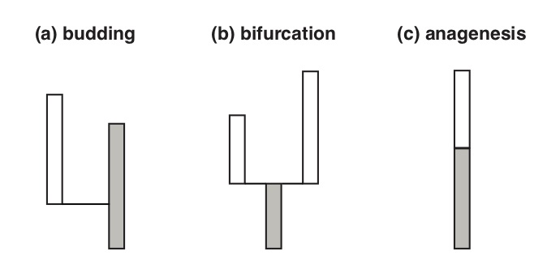

```{r setup, include = FALSE}
knitr::opts_chunk$set(
  collapse = TRUE,
  comment = "#>",
  fig.width = 5, fig.height = 5
)
```
```{r, echo = FALSE, results = "hide", message = FALSE}
devtools::load_all()
```

This vignette provides information about how the package stores and outputs information about species taxonomy via the `taxonomy` object and available options for simulating species taxonomy.

## Contents

* [The taxonomy object]
* [Simulating taxonomy]  

### The taxonomy object

A phylogenetic tree object, in the format used by most software packages, does not typically contain information about species over time.
A timescaled phylogeny is informative about the minimum number of co-existing lineages at a given moment but not about the start and end point of species or the *mode* of speciation. 
Three modes of speciation that have been discussed widely in palaeobiological literature are shown in Fig. 1. and can be modelled using `FossilSim`: 

  * *budding or asymmetric speciation*, which gives rise to one new species and does not result in the extinction of the ancestor
  * *bifurcating or symmetric speciation*, which gives rise to two new species and results in the extinction of the ancestor species
  * *anagenetic speciation*, which gives rise to one new species and results in the extinction of the ancestor

```{r echo=FALSE, out.width = "80%", fig.cap = cap}

cap = "**Fig. 1**. Three different modes of speciation that can be simulated using FossilSim."
```

The distinction between these processes is important because they have consequences on parameter estimates using different methods.

In molecular phylogenetics, we typically draw trees as fully bifurcating structures (i.e. each node gives rise to two descendant branches).
This is also how trees are stored in computer memory by most phylogenetic software packages, including `ape`.
However, it may not be the case that each internal edge represents a unique species. 
Instead, some speciation events may be budding rather than bifurcating or anagenesis may have occurred at some point along internal edges.
To explore the impact of different speciation modes it is valuable to know the relationship between species through time (the *taxonomy*) and the corresponding tree object.
 
`FossilSim` contains options for simulating species evolution under different speciation modes,
described in the section [Simulating taxonomy].
Information about the true species taxonomy is stored in the `taxonomy` object, which will be associated with the corresponding `phylo` object used to simulate species evolution. 

The object contains a dataframe detailing species taxonomy, which contains the following 7 fields for each edge and species in the corresponding `phylo` object:

* `sp` the true species identity label. If all species originated via budding or bifurcation this will always correspond to the terminal-most edge label (i.e. the youngest node) associated with each species. This is not the case if the data set also contains anagenetic species, when multiple species may be associated with a single edge

* `edge` edge label of the branch in the corresponding phylo object. Note that some species may be associated with multiple edges

* `parent` ancestor of species `sp`. Parent labels follow the same convention as species. The label assigned to the parent of the origin or root will be zero

* `start` start time of the corresponding edge and/or origin time of the species. If the corresponding edge is also the oldest edge associated with the species this value will equal the species origination time. If speciation mode is asymmetric or symmetric the speciation time will match the start time of the corresponding edge. If speciation mode is anagenetic the speciation time will be younger than the start time of the corresponding edge

* `end` end time of the corresponding edge and/or end time of the species. If the corresponding edge is also the youngest edge associated with the species this value will equal the species end time. Unless the species end time coincides with an anagenetic speciation event, the species end time will match the end time of the corresponding edge. If the species end time coincides with an anagenetic speciation event, the end time will be older than the end time of the corresponding edge

* `mode` mode = speciation mode. "o" = origin or "r" = root (the edge/species that began the process). "b" = asymmetric or budding speciation. "s" = symmetric or bifurcating speciation. "a" = anagenetic speciation

A new `taxonomy` object can be created by passing the above information to the `taxonomy()` function.

Cryptic species can also be simulated. Under cryptic speciation the descendant species will be indistinguishable from the ancestor and the `taxonomy` object can incorporate this information using the additional optional fields:

* `cryptic` TRUE if the speciation event was cryptic. If this information is not passed to `taxonomy()`, the function assumes `cryptic = FALSE` for all species

* `cryptic.id` cryptic species identity, i.e. ancestral species that the current species will be identified as. If `cryptic = TRUE`, `cryptic.id` will differ from the true species identity `sp`

The relationship between information provided by the `taxonomy` object and the corresponding `phylo` object will become clear when you start simulating species and exploring the output.

The `taxonomy` object can be used as the starting point for simulating fossils or other downstream analyses that require information about discrete species units.

**Special Note** The birth and death rates used as parameters in the birth-death process typically do not correspond to the rates of appearance and extinction of species under the above processes, unless speciation occurs entirely via budding.

## Simulating taxonomy

Species evolution or taxonomy can be simulated in `FossilSim` under a mixed model of speciation that can incorporate three modes of speciation -- budding (or asymmetric), bifurcating (or symmetric) and anagenetic -- in addition to cryptic speciation.
\todo add citation Stadler 2018
This model of mixed speciation was described previously by Bapst \todo add citation and is also available as part of the `paleotree` package.

In a birth-death process $\lambda$ is the rate at which branching events occur, while $\mu$ is the rate at which lineage termination occurs. 
These are the parameters typically used to simulate birth-death trees (see the code snippet below for an example).
The mixed model of speciation includes three additional parameters, $\beta, \lambda_a$ and $\kappa$, which are defined as follows:

* $\beta$ is the probability that a branching event corresponds to a bifurcating speciation event, while $1 - \beta$ is the probability that the event corresponds to a budding event.
If $\beta = 0$ all speciation occurs via budding. 
If $\beta = 1$ all speciation occurs via bifurcation, which is equivalent to assuming all edges in a phylogenetic tree correspond to a unique species
* $\lambda_a$ is the rate of anagenetic speciation that occurs along internal edges 
* $\kappa$ is the probability that any given speciation event will be cryptic

The relationship between these processes and the underlying structure or branching process in the corresponding `phylo` object is described in section [The `taxonomy` object].
Simulating species evolution or taxonomy for any user specified tree in `FossilSim` is straightforward.

```{r}
# set the random number generator seed to generate the same results using the same code
set.seed(123)

# simulate a tree using TreeSim conditioned on tip number
lambda = 1
mu = 0.2
tips = 8
t = TreeSim::sim.bd.taxa(tips, 1, lambda, mu)[[1]]
# t is an object of class phylo
t
# use t$edge, t$edge.length, t$root.edge to see the tree attributes

# simulate under complete budding speciation 
s = sim.taxonomy(t) # this is equivalent to using the default parameters beta = 0, lambda_a = 0, kappa = 0
# s is an object of class taxonomy
s
```

Note that the way `sim.taxonomy` assigns budding species is deterministic -- at each branching event, the "left" descendant edge will always be assigned the ancestral species label and the "right" descendant edge will always be the new species.
This means even without setting the random number seed `sim.taxonomy` will always produce the same output when $\beta = 0$.

`FossilSim` contains various options for plotting the package output.
The `plot.taxonomy` function will produce a plot highlighting species taxonomy along with the corresponding bifurcating tree object.

Note that R detects what type of object you are trying plot, in this case taxonomy, and will automatically call `plot.taxonomy` when you apply the function `plot` to an object of class `taxonomy`.
Use `?plot.taxonomy` to view the further options that can be used to change the appearance of the figure.

```{r}
plot(s, t, legend.position = "topleft")
```

```{r}
# simulate under complete bifurcating speciation
s = sim.taxonomy(t, beta = 1)
plot(s, t, legend.position = "topleft")
```

```{r}
# simulate under mixed speciation
s = sim.taxonomy(t, beta = 0.5, lambda.a = 1, kappa = 0.1)
plot(s, t, legend.position = "topleft")
```

Note that `plot.taxonomy` only plots the true species, and ignores any information about cryptic specieation (i.e. the function uses the `sp` labels and ignores `cryptic.id`).

Given an existing `taxonomy` object you can also add anagenetic or cryptic species downstream using the functions `sim.anagenetic.species` and `sim.cryptic.species`.
These functions also return a `taxonomy` object.

```{r}
# simulate taxonomy without anagenetic or cryptic species
s1 = sim.taxonomy(t, beta = 0.5)

# simulate anagenetic species 
# note this function also requires the corresponding tree object
s2 = sim.anagenetic.species(t, s1, lambda.a = 1)

# simulate cryptic species
s3 = sim.cryptic.species(s2, kappa = 0.1)
```

These functions can not be used with `taxonomy` objects that already contain anagenetic or cryptic species.

## See also

See the `paleotree` vignette to see how `FossilSim` objects can be converted into `paleotree` objects.

